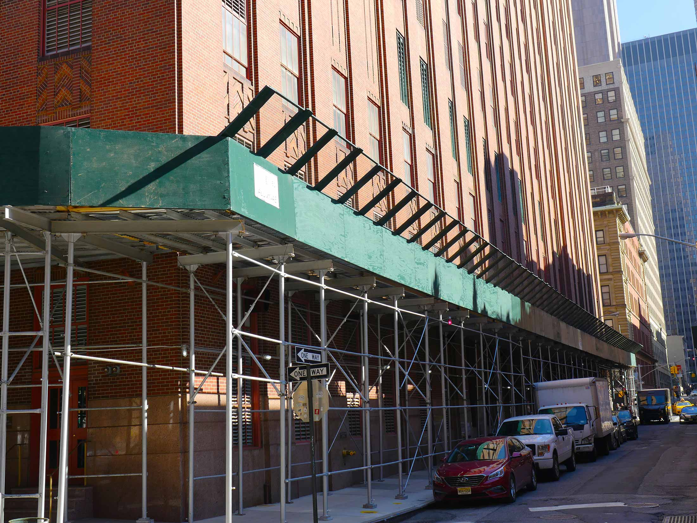

<!--<h1 style="color: black; padding-left: 40px"> <b> Sidewalk Bridges - The Unregulated Eyesore </b> </h1>

About the project

    Since 1980, buildings over six stories in New York are required to undergo a facade inspection every five years, which requires sidewalk sheds be constructed.
    While these sheds are supposed to be temporary structures, evidence suggests that many of these sidewalk sheds remain up for years.
    Local media outlets and politicians commonly comment on the negative impacts these sheds have on the local community. This research will quantify these claims to understand how these long-term sheds may have adverse effects on quality of life metrics. The project will use geocoded data to compare how city blocks change in these areas when a sidewalk bridge is installed.
    The project will provide policy recommendations, as well as visualizations and tools that quantify the issue.

    <a href="http://output.jsbin.com/ficepeq/1"><button style="font-weight: bold; font-size: 20px; font face: verdana;"> View Maps</button></a>

 -->

<html>
 <body>
  Welcome CUSP Capstone!
  
 </body>
</html>
